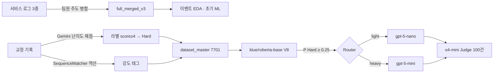

# SmartRouter — 문장 교정 LLM 라우팅과 평가 감사

한국어 문장 교정 서비스(Sentencify)의 요청을 난이도에 따라 **경량 모델(light)** 또는 **상위 모델(heavy)**로 보내는 라우터입니다. 라우터·교정 생성·LLM-as-a-Judge 평가 파이프라인을 팀 프로젝트에서 직접 만들고 실행했습니다. 이후 결과를 다시 검증해 **평가 설계의 결함과 지름길 학습(shortcut learning)**을 찾아냈고, 이 레포는 그 과정과 수정된 평가를 정리한 최종본입니다.

> 이 최종본의 재구성·검증 코드와 문서는 AI(Claude) 보조로 작성했습니다. 역할 구분은 [docs/contribution.md](docs/contribution.md)에 있습니다.

## 요약

| 항목 | 당시 보고 | 재검증 결과 |
|---|---|---|
| 분류기 F1 (@0.25) | .788 | 재현됨. 다만 **체크포인트·임계값 선택에 쓴 test 분할의 결과**입니다 |
| 분류기의 실제 역할 | 문장 난이도 예측 | 결정의 **99.65%가 "강도=STRONG이면 heavy" 규칙과 같음**. 규칙의 F1도 .788 |
| "비용 절감 43.8%" (V8 시뮬레이션) | 비용 절감률 | 경량 모델 **배정률**이며 비용이 아님 |
| "품질 리스크 5.9%" | FN/전체 | 실제 Hard 중 놓친 비율은 **12.7%** |
| Judge 평가 (100건) | 비용 36.6% 절감, 품질 98.4% | 산술은 재현됨. 점수 차이의 **95% CI가 모두 0을 포함**하고, 비용은 글자수 기반 추정. 경량 모델만 써도 98.1% |

결론적으로, 당시 파이프라인은 동작했지만 **학습된 라우터가 단순 규칙보다 낫다는 근거는 없었습니다.** 원인은 라벨(교정 변화 크기 채점)과 강도 태그(교정 변화 비율로 역산)가 같은 교정 결과에서 나왔기 때문입니다. 자세한 분석은 [docs/decisions.md](docs/decisions.md)에 있습니다.

## 파이프라인



- 담당: 이벤트 EDA·초기 ML, 라벨링·역공학, V8 학습, 임계값·라우팅, 생성·Judge 실행. 로그 병합은 팀원이 주도했습니다.
- 초기 ML(RF/LightGBM/CatBoost)은 이벤트 분류 문제였고, 라우터 학습 데이터와는 별개의 계보입니다.

## 재검증에서 한 일

| 작업 | 방법 | 결과 |
|---|---|---|
| 로그 병합 재현 | `validate=`로 카디널리티 검사, pandas 버전 의존 중복 제거 제거 | 62097행 유지, 매칭 48331 / 미매칭 13766, v3 해시 일치 |
| 저장 예측 재계산 | 1156행 혼동행렬, 임계값 비교 | 과거 표와 소수 6자리까지 일치 |
| 실제 체크포인트 재추론 | 로컬 가중치(SHA `a641edd…`)로 1156행 CPU 추론 | 결정 1156/1156 일치 |
| 기준선 비교 | 강도 규칙 라우터, 강도별 AUC | 일치율 99.65%, 강도 내부 AUC .62–.67 |
| Judge 재분석 | 쌍체 bootstrap 95% CI | C−A +0.015 [−0.22, +0.245] |

새 학습이나 유료 API 재호출은 하지 않았습니다. 결과 유형 구분은 [docs/provenance.md](docs/provenance.md)에 있습니다.

## 실행

```bash
uv sync                       # core (CPU torch)
uv run pytest                 # 단위 테스트 (+ 로컬 가중치가 있으면 smoke 테스트)

# 공개용 합성 예시 (실제 성능 근거가 아님)
uv run smartrouter evaluate     --csv examples/synthetic/routing_predictions.csv
uv run smartrouter judge-report --csv examples/synthetic/judge_results.csv

# 비공개 원본이 있을 때
uv run smartrouter audit-data   --raw-dir <data/raw> --v3 <full_merged_v3.csv> --out reports/data_audit.json
uv run smartrouter evaluate     --csv "<5. test_results_routed.csv>" --out reports/routing_eval.json
uv run smartrouter judge-report --csv "<8. evaluation_results.csv>" --out reports/judge_summary.json
uv run smartrouter reinfer      --csv "<5. test_results_routed.csv>" --limit 1156

# 가중치(models/smart_router_v3 또는 ROUTER_MODEL_PATH)가 있을 때
uv run smartrouter predict --text "합성 예시 문장" --intensity MODERATE

# 선택: 로컬 라우팅 API (생성 호출 없음)
uv sync --extra api && uv run uvicorn smartrouter.main:app --port 8000
```

어떤 명령도 유료 API를 호출하지 않으며, 입력 문장을 출력하거나 리포트에 저장하지 않습니다. 원본 데이터와 가중치는 고객 데이터를 포함하므로 공개하지 않습니다.

## 구조

```text
src/smartrouter/
  cli.py            # audit-data / evaluate / judge-report / predict / reinfer
  data.py           # 로그 병합 + 카디널리티 검사 + v3 해시 확인
  evaluation.py     # 임계값 지표, 강도 규칙 기준선, 강도별 AUC
  judge.py          # 저장 Judge 결과 요약 + bootstrap CI
  models/           # 로컬 전용 RoBERTa 분류기
  router/           # RoBERTaDynamicRouter, IntensityRuleRouter
  api/, main.py     # 선택: 로컬 /route API
tests/              # 합성 데이터 단위 테스트, 가중치 smoke 테스트
examples/synthetic/ # 공개용 합성 CSV
docs/               # provenance, decisions, contribution
research/           # 사후 재구성 노트북 (당시 실행 기록 아님)
legacy/             # 기본 경로에서 제외한 이전 재구성본 (Bedrock/Azure, Docker, 배포 스크립트, 과거 차트)
```

## 한계와 다음 과제

- test 지표는 모델 선택에 쓴 분할의 결과이며, 별도 hold-out이 없습니다.
- 학습 데이터의 강도 태그 대부분(6648/7701)은 교정 결과에서 역산한 값이라, 실제 사용자가 고른 강도와 분포가 다를 수 있습니다.
- Judge 평가는 100건, 단일 Judge이며 비용은 추정치입니다.
- 다음 과제: 원문 기준 그룹 분할로 "강도 이외의 문장 신호"를 측정하는 진단 실험, 요청 시점에 관측 가능한 라벨로 재정의.
