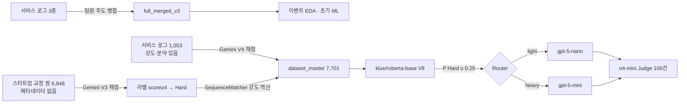

# SmartRouter — 한국어 문장 교정 LLM 라우팅 파이프라인

> 이어드림스쿨 5기 스타트업 연계 프로젝트 · 팀장 · 장려상(3등)  
> 이 레포의 재구성·검증 코드와 문서는 AI(Claude) 보조로 작성했습니다. 역할 구분은 [docs/contribution.md](docs/contribution.md)에 있습니다.

## 1. 프로젝트 개요

**Sentencify**는 사용자가 교정 강도(WEAK / MODERATE / STRONG)와 분야를 선택하면 LLM이 한국어 문장을 교정해 주는 서비스입니다.

**관찰**: 서비스 로그를 분석해 보니 요청 난이도나 사용자 의도와 무관하게 대부분의 트래픽이 경량 모델로 가고 있었습니다. 새로 쓰기 수준의 Strong 요청이나 분야별 교정 요청도 마찬가지였습니다. 반대로 모든 요청을 상위 모델로 보내면 비용이 커집니다.

**가설**: 사용자가 고른 강도·분야를 의도(z)로 보고, 교정 전 문장(x)과 함께 넣어 모델을 배정합니다(y = f(x, z), 발표 제목 "의도 맞춤형 라우팅").

**목표**: `[강도] [분야] 문장`을 입력으로 받아 교정 난이도를 예측합니다. 상위 모델이 필요한 요청만 heavy로, 나머지는 light로 보내 품질과 비용의 균형을 조정합니다.

**담당 역할**

| 영역 | 담당 |
|---|---|
| 서비스 로그 3종 병합 | 팀원 주도 |
| 이벤트 EDA | 본인, 팀원 |
| 초기 ML (RF / LightGBM / CatBoost), feature importance 검토 | 본인, 팀원 |
| 난이도 라벨링 (Gemini 채점), 메타데이터 역공학 | 본인 |
| RoBERTa V8 학습, 체크포인트 선택 | 본인, 팀원 |
| 임계값 튜닝, 라우팅 설계, 트래픽 시뮬레이션 | 본인 |
| 교정 생성 · Judge 평가 실행 | 본인 |

→ 상세: [docs/contribution.md](docs/contribution.md)

## 2. 데이터 구축

### 서비스 로그 병합

서비스 운영 로그 3종(usage, client, event)을 병합해 **62,097행**의 통합 데이터셋(`full_merged_v3`)을 만들었습니다. 병합은 팀원이 주도했고, 이 데이터로 이벤트 EDA와 초기 ML 탐색을 팀원과 함께 진행했습니다. feature importance 분석에서 실제 서비스에는 더 이상 없는 컬럼이 포함된 것을 팀장으로서 발견해 제외를 제안했고, 매주 서비스 멘토 화상회의에서 확인해 제외하기로 확정했습니다.

### 학습 데이터가 부족했던 문제

사용자가 고른 강도·분야까지 남은 **서비스 로그는 1,000건 남짓**이었고, 학습에는 부족했습니다. 스타트업이 함께 준 **교정 문장 쌍 6,648건**(자사 서비스로 유튜브 등 자체 콘텐츠를 교정한 기록)은 양이 충분했지만, DB를 거치지 않아 강도·분야가 없었습니다. 이 데이터를 입력 형식에 맞춰 되살린 것이 아래 역공학입니다.

### 난이도 라벨링

Gemini에게 원문과 교정문을 비교시켜 교정 난이도를 **1–5점으로 채점**했고, **score ≥ 4를 Hard(1)**로 정의했습니다. 서비스 로그(v1)에는 강도·분야도 함께 보여 줬습니다(V4 프롬프트). 교정 문장 쌍(v2)에는 원문·교정문만 보여 줬습니다(V3 프롬프트).

### 메타데이터 역공학

강도가 없는 교정 문장 쌍(v2, 6,648건)은 라벨링 후 원문과 교정문의 **SequenceMatcher 비율로 강도를 역산**했고, 분야는 NONE으로 두었습니다.

| 비율 | 강도 |
|---|---|
| > 0.9 | WEAK |
| > 0.6 | MODERATE |
| ≤ 0.6 | STRONG |

### 최종 데이터셋

| 원천 | 행 수 | 강도 태그 출처 |
|---|---|---|
| v1 서비스 로그 (`문장교정기록.json`) | 1,053 | 사용자가 실제로 고른 값 |
| v2 스타트업 교정 문장 쌍 (`munch_data`) | 6,648 | SequenceMatcher 역산 |
| **합계 `dataset_master`** | **7,701** | |

→ 상세: [docs/labeling.md](docs/labeling.md) (프롬프트·분포·한계), 당시 코드 [research/labeling/](research/labeling/), [docs/provenance.md](docs/provenance.md), [docs/decisions.md §2](docs/decisions.md#2-학습-데이터)

## 3. 모델링과 라우팅 설계

### 초기 ML 탐색

RF / LightGBM / CatBoost로 이벤트 분류를 팀원과 함께 시도했습니다. 이 단계는 서비스 이벤트 패턴 분석이며, 이후 라우터 학습과는 다른 문제입니다.

### 분류기에 이르기까지의 시도

문장만으로는 난이도를 잘 맞추지 못해, 라벨·입력·데이터를 바꿔 가며 시도했습니다. 아래 수치는 당시 노트북에 저장된 값입니다.

| 시도 | 입력 | 결과 |
|---|---|---|
| Gemini 점수 이진 분류 (BERT) | 문장만 | Macro F1 .638 |
| Gemini 점수 회귀 (RoBERTa) | 문장만 | R² 최고 .198 |
| RoBERTa 임베딩 + 부스팅 앙상블 | 문장만 | Macro F1 .628 |
| RoBERTa, 서비스 교정기록 1,053건만 | `[강도] [분야] 문장` | Hard F1 .494 |
| RoBERTa, 교정기록 + 강도를 역산한 교정 쌍 7,701건 | `[강도] [분야] 문장` | Hard F1 .78 → **V8 채택** |

Macro F1과 Hard F1은 계산 방식이 달라 직접 비교할 수 없습니다. 전체 21개 노트북과 단계별 설명은 [research/experiments/](research/experiments/README.md)에 있습니다.

### RoBERTa 분류기 (V8)

라우팅을 위한 이진 분류기를 학습했습니다.

| 항목 | 설정 |
|---|---|
| 베이스 모델 | `klue/roberta-base` |
| 입력 형식 | `[INTENSITY] [FIELD] sentence` |
| 손실 함수 | class-weighted cross-entropy |
| 체크포인트 | checkpoint-205 (epoch 1, eval F1 .7837) |
| 기본 임계값 | 0.25 (P(Hard) ≥ 0.25 → heavy) |

### 임계값 설계

임계값 0.25는 Recall을 우선하는 설정입니다. 대안 임계값 0.20은 Recall .886 / F1 .786입니다.

→ 상세: [docs/decisions.md §2](docs/decisions.md#2-학습-데이터) · [§3](docs/decisions.md#3-분할체크포인트임계값-제출-v8)

## 4. 파이프라인



**라우팅**: 분류기가 P(Hard) ≥ 임계값이면 heavy, 아니면 light로 배정합니다.

**교정 생성**: 실제 LLM 교정을 수행했습니다. light 요청은 gpt-5-nano, heavy 요청은 gpt-5-mini가 처리합니다. (`apps/eval/run_inference_azure.py`로 실행)

**Judge 평가**: o4-mini를 Judge로 사용해 100건의 교정 품질을 1–5점으로 채점했습니다. (seed 42, `apps/eval/test_inference_azure.py`로 실행)

→ 상세: [docs/provenance.md §4](docs/provenance.md#4-단계별-근거-연결) · [§2](docs/provenance.md#2-결과-유형-구분)

## 5. 결과

### 분류기 성능 (test 1,156건, @0.25)

| | Precision | Recall | F1 |
|---|---:|---:|---:|
| RoBERTa V8 | .718 | .873 | **.788** |

**혼동행렬**

|  | 예측 Heavy | 예측 Light |
|---|---:|---:|
| 실제 Hard | TP 467 | FN 68 |
| 실제 Easy | FP 183 | TN 438 |

- **경량 모델 배정률**: 43.8% (506 / 1,156)
- **놓친 Hard**: 실제 Hard 대비 12.7% (68 / 535), 전체 대비 5.9% (68 / 1,156)

### Judge 평가 (100건)

| 시나리오 | 설명 | 평균 점수 |
|---|---|---:|
| A | 경량 모델만 (gpt-5-nano) | 4.280 |
| B | 상위 모델만 (gpt-5-mini) | 4.365 |
| C | 라우터 배정 | 4.295 |

## 6. 한계와 다음 과제

분류기가 강도 태그(STRONG/MODERATE/WEAK)에 크게 의존하며, **단순 규칙("STRONG이면 heavy")과 99.65% 같은 결정**을 내립니다.

원인은 데이터에 있습니다. 데이터의 86%(v2)에서 라벨(V3의 교정 변화 정도 채점)과 강도 태그(교정 변화 비율 역산)가 같은 교정 결과에서 나왔습니다. 학습 데이터 분포에서도 드러납니다.
- STRONG의 Hard 비율은 71.5%, WEAK는 1.6%입니다.
- 분야는 96.8%가 NONE입니다.
- 실제 선택값인 v1의 STRONG Hard 비율은 52.2%로, 역산값인 v2(72.3%)보다 덜 치우쳐 있습니다.

가설은 사용자의 **실제 의도**를 넣는 것이었지만, 데이터 대부분의 강도는 교정 결과로 만든 값이었습니다([docs/labeling.md §5](docs/labeling.md#5-결과-분포와-태그-의존)).

체크포인트 선택, 임계값 선택, 최종 지표 산출에 모두 같은 test 분할을 사용해 낙관 편향이 있습니다.

**다음 과제**
- 강도 태그 외 문장 자체의 난이도 신호 측정 (CPU 진단 실험)
- 교정 결과가 아닌, 요청 시점에 관측 가능한 기준으로 라벨 재정의
- 별도 hold-out 분할 설계

→ 평가 감사 상세: [docs/decisions.md](docs/decisions.md)

## 7. 기술 구현

### CLI

어떤 명령도 유료 API를 호출하지 않으며, 입력 문장을 출력하지 않습니다.

| 명령 | 설명 |
|---|---|
| `smartrouter audit-data` | 서비스 로그 3종 병합 + 카디널리티 검사 + v3 해시 확인 |
| `smartrouter evaluate` | 저장 예측 재계산: 임계값별 지표, 기준선(강도 규칙) 비교, 강도별 AUC |
| `smartrouter audit-labels` | 학습 데이터의 강도·분야별 Hard 비율(전체, 출처별) |
| `smartrouter judge-report` | 저장 Judge 결과 요약 + 쌍체 bootstrap 95% CI |
| `smartrouter predict` | 단일 문장 라우팅 (모델 + 규칙 기준선 동시 출력) |
| `smartrouter reinfer` | 로컬 체크포인트로 재추론, 저장 결과와 일치 확인 |

### 실행

```bash
uv sync                       # core (CPU torch)
uv run pytest                 # 단위 테스트 26개

# 공개용 합성 예시
uv run smartrouter evaluate     --csv examples/synthetic/routing_predictions.csv
uv run smartrouter judge-report --csv examples/synthetic/judge_results.csv

# 비공개 원본이 있을 때
uv run smartrouter audit-data   --raw-dir <data/raw> --v3 <full_merged_v3.csv>
uv run smartrouter audit-labels --csv <dataset_master.csv>
uv run smartrouter evaluate     --csv <test_results_routed.csv>
uv run smartrouter judge-report --csv <evaluation_results.csv>
uv run smartrouter reinfer      --csv <test_results_routed.csv> --limit 1156

# 선택: 로컬 라우팅 API
uv sync --extra api && uv run uvicorn smartrouter.main:app --port 8000
```

### 레포 구조

```text
src/smartrouter/
  cli.py            # 위 6개 명령어
  data.py           # 로그 병합 + 카디널리티 검사 + v3 해시 확인
  evaluation.py     # 임계값 지표, 강도 규칙 기준선, 강도별 AUC, 라벨 분포
  judge.py          # 저장 Judge 결과 요약 + bootstrap CI
  models/           # 로컬 전용 RoBERTa 분류기
  router/           # RoBERTaDynamicRouter, IntensityRuleRouter
  api/, main.py     # 선택: 로컬 /route API
tests/              # 합성 데이터 단위 테스트 26개
examples/synthetic/ # 공개용 합성 CSV
docs/               # labeling, provenance, decisions, contribution
research/experiments/ # 당시 실험 노트북 21개 (서비스로그 분석 · 난이도 분류기 · 라우팅 평가, 출력 제거)
research/labeling/    # 학습 데이터 구축 당시 원본 코드 (본인 작성, 출력 제거)
legacy/             # 이전 재구성본 (Bedrock/Azure, Docker, 배포 스크립트)
```

원본 데이터와 가중치는 고객 데이터를 포함하므로 공개하지 않습니다.
